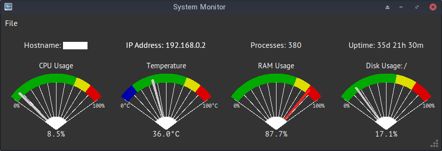

# System Monitor for Python/Tk

<!--
SPDX-FileCopyrightText: © 2024 Stacey Adams <stacey.belle.rose@gmail.com>

SPDX-License-Identifier: MIT
-->


[](https://api.reuse.software/info/github.com/staceybellerose/sysmon-pytk)
[](https://www.codefactor.io/repository/github/staceybellerose/sysmon-pytk)
[](https://codeclimate.com/github/staceybellerose/sysmon-pytk/maintainability)

System monitor written in Python using Tk. It monitors CPU usage and
temperature, RAM usage, and disk usage of the primary disk (containing the
root partition). It also displays the system's hostname, IP address, uptime,
and current process count.



## Pre-installation

### Make sure the Python interface to Tcl/Tk (tkinter) is installed

Since this is a GUI application using tkinter, tkinter must be installed
separately.

* Debian, Ubuntu, and derivatives

    ```bash
    sudo apt install python3-tk
    ```

* Fedora and derivatives

    ```bash
    sudo dnf install python3-tkinter
    ```

* MacOS

    ```bash
    brew install python-tk
    ```

## Install Using pip

Download the wheel file from the latest release, then install it. Once a PyPI
account can be set up, the program will be downloadable from there.

```bash
pip install ./sysmon_pytk-0.4.1-py3-none-any.whl
```

Two versions of the program will be installed, a GUI program and a command line
program.

To run the GUI program:

```bash
sysmon
```

To run the command line program:

```bash
cli_sysmon
```

## Install Manually, for local development

Note when cloning this repo that it has a submodule
[Azure ttk theme](https://github.com/rdbende/Azure-ttk-theme)
which must be copied over:

```bash
git clone --recurse-submodules https://github.com/staceybellerose/sysmon-pytk.git
```

If you didn't clone the submodule when cloning this repo, run this to update:

```bash
git submodule update --init --recursive
```

### Install the required python packages

```bash
make venv
```

### Generate translation files

Translations are available in English, Spanish, German, and Norwegian Bokmål.
To build the translation files, run the following bash commands:

```bash
make translations
```

| Run the GUI program | |
|-|-|
| While the venv is activated | `python -m sysmon_pytk.gui_monitor &` |
| Explicitly using the venv | `venv/bin/python -m sysmon_pytk.gui_monitor &` |
| Let make handle everything automatically | `make run` |

| Run the command line program | |
|-|-|
| While the venv is activated | `python -m sysmon_pytk.cli_monitor &` |
| Explicitly using the venv | `venv/bin/python -m sysmon_pytk.cli_monitor &` |
| Let make handle everything automatically | `make cli` |

## Translations

Special thanks to our translators!

| Language         | Code  | Translator |
|------------------|-------|------------|
| German           | de    | Alisyn Arness |
| Spanish          | es    | Stacey Adams (author) |
| Norwegian Bokmål | nb_NO | [Allan Nordhøy](https://github.com/comradekingu) |
